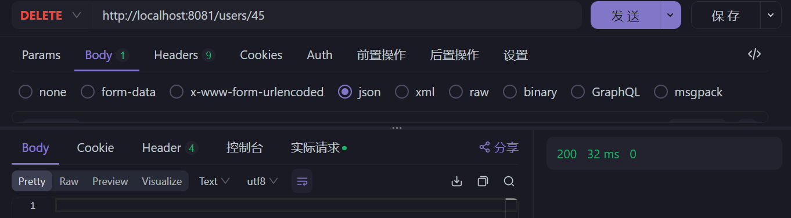

### 项目简介

**Spring Boot** + **Neo4j** 对用户节点（`User`）执行增删查改（CRUD）操作。

### 功能说明

项目实现了对用户节点（`User`）的以下功能：

1. **添加用户节点**：通过 POST 请求添加新的用户节点到 Neo4j 图数据库。
2. **查询用户节点**：通过 GET 请求查询单个或多个用户节点的详细信息。
3. **更新用户节点**：通过 PUT 请求更新用户节点的信息。
4. **删除用户节点**：通过 DELETE 请求根据用户 ID 删除节点。

### 技术栈

- **Spring Boot 2.x**：构建基础框架。
- **Spring Data Neo4j**：实现图数据库的持久层操作。
- **Neo4j 4.x/5.x**：图数据库。
- **Maven**：项目构建与依赖管理。
- **Lombok**：简化 Java Bean 开发。

### 环境要求

- **JDK 1.8** 及以上。
- **Maven 3.6** 及以上。
- **Neo4j 4.x/5.x**（建议使用 Neo4j Desktop 或 Docker 安装）。

### 数据库配置

在 `application.yml` 中配置 Neo4j 数据库连接：

```yaml
spring:
  data:
    neo4j:
      uri: bolt://localhost:7687
      username: neo4j
      password: 123456
  neo4j:
    open-in-view: true
```

### 数据模型

用户节点 `User` 包含以下属性：

- `id`（自动生成的唯一标识）
- `name`（用户名）
- `age`（用户年龄）
- `email`（用户电子邮箱）

### 项目结构

- **`User.java`**：用户实体类，映射到 Neo4j 中的用户节点。
- **`UserRepository.java`**：数据访问层，使用 Spring Data Neo4j 进行节点和关系的操作。
- **`UserService.java`**：业务逻辑层，封装 CRUD 逻辑。
- **`UserController.java`**：API 控制器，提供 RESTful 接口。

### 代码实现


#### 1. `User` 实体类

```java
import org.springframework.data.neo4j.core.schema.Id;
import org.springframework.data.neo4j.core.schema.Node;

@Node("User")
public class User {

    @Id
    private Long id;
    private String name;
    private int age;
    private String email;

    // Getters and setters
}
```

#### 2. `UserRepository` 接口

```java
import org.springframework.data.neo4j.repository.Neo4jRepository;

public interface UserRepository extends Neo4jRepository<User, Long> {
}
```

#### 3. `UserService` 业务逻辑类

```java
import org.springframework.beans.factory.annotation.Autowired;
import org.springframework.stereotype.Service;

import java.util.List;
import java.util.Optional;

@Service
public class UserService {

    @Autowired
    private UserRepository userRepository;

    public User addUser(User user) {
        return userRepository.save(user);
    }

    public List<User> getAllUsers() {
        return userRepository.findAll();
    }

    public Optional<User> getUserById(Long id) {
        return userRepository.findById(id);
    }

    public User updateUser(Long id, User userDetails) {
        User user = userRepository.findById(id);
        user.setName(userDetails.getName());
        user.setAge(userDetails.getAge());
        user.setEmail(userDetails.getEmail());
        return userRepository.save(user);
    }

    public void deleteUser(Long id) {
        userRepository.deleteById(id);
    }
}
```

#### 4. `UserController` 控制器类

```java
import org.springframework.beans.factory.annotation.Autowired;
import org.springframework.web.bind.annotation.*;

import java.util.List;
import java.util.Optional;

@RestController
@RequestMapping("/users")
public class UserController {

    @Autowired
    private UserService userService;

    @PostMapping
    public User addUser(@RequestBody User user) {
        return userService.addUser(user);
    }

    @GetMapping
    public List<User> getAllUsers() {
        return userService.getAllUsers();
    }

    @GetMapping("/{id}")
    public Optional<User> getUserById(@PathVariable Long id) {
        return userService.getUserById(id);
    }

    @PutMapping("/{id}")
    public User updateUser(@PathVariable Long id, @RequestBody User userDetails) {
        return userService.updateUser(id, userDetails);
    }

    @DeleteMapping("/{id}")
    public void deleteUser(@PathVariable Long id) {
        userService.deleteUser(id);
    }
}
```

### API 接口说明

1. **添加用户节点**:

    - **URL**: `/users`
    - **Method**: `POST`
    - **Request Body**:

   ```json
   {
       "name": "ruiling",
       "age": 18,
       "email": "rl.su@outlook.com"
   }
   ```

   **Response**: 返回创建的用户节点的详细信息。


2. **查询所有用户节点**:

    - **URL**: `/users`
    - **Method**: `GET`
    - **Response**: 返回所有用户节点的列表。
    - 
3. **查询单个用户节点**:

    - **URL**: `/users/{id}`
    - **Method**: `GET`
    - **Path Variable**: `id` 用户节点ID)
    - **Response**: 返回指定用户节点的详细信息。
    - 
4. **更新用户节点**:

    - **URL**: `/users/{id}`
    - **Method**: `PUT`
    - **Request Body**:

   ```json
   {
       "name": "ruiling-ruiling",
       "age": 22,
       "email": "ruiling@excemple.com"
   }
   ```

    - **Response**: 返回更新后的用户节点信息。
    - 
5. **删除用户节点**:

    - **URL**: `/users/{id}`
    - **Method**: `DELETE`
    - **Response**: 成功删除后返回状态信息。



### 快速开始

1. **启动 Neo4j**（确保你的 Neo4j 数据库已启动并配置了正确的用户名和密码）。
2. **运行项目**：
   使用以下命令运行 Spring Boot 应用：

   ```bash
   mvn spring-boot:run
   ```
3. **访问 API**：
   项目启动后，可以通过 `http://localhost:8081/users` 来访问用户节点的 CRUD 接口。

### 扩展功能

- **图关系**: 在此项目基础上，你可以进一步扩展，实现用户与其他实体之间的关系，例如用户之间的朋友关系、用户发表的文章等。
- **复杂查询**: 使用 Cypher 查询语言执行复杂的图形查询，例如寻找最短路径等。
- **可视化界面**: 结合 Neo4j 浏览器界面，实时查看节点和关系的变化。

